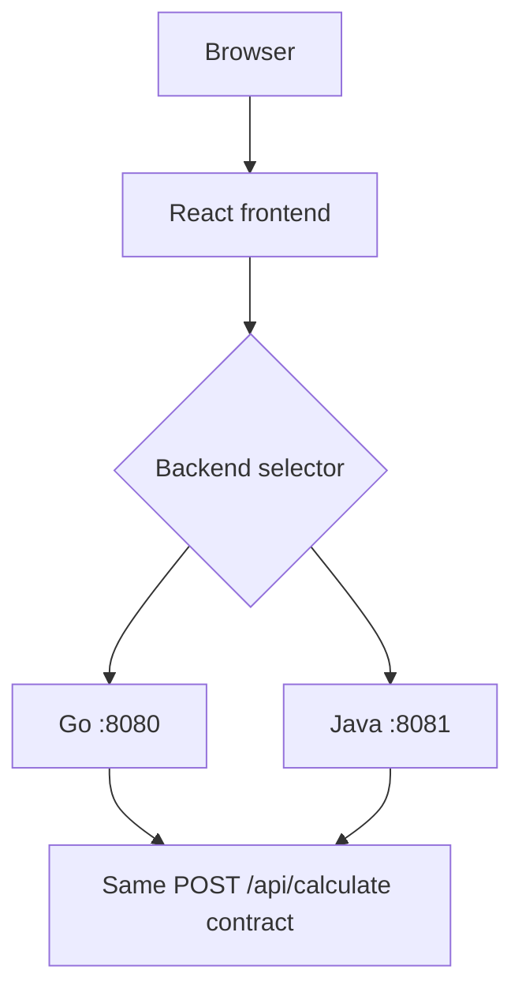

# Fullstack Calculator — Double Backend

A React + TypeScript calculator backed by two interchangeable REST services. Go is the primary, assessment-aligned backend; Java 21 with Spring Boot is an additional independent implementation. The UI lets the user select either backend, and both expose the same calculator contract.

## Assessment Coverage

| Capability | Assessment classification | Delivery status |
|---|---|---|
| React frontend | Required | Implemented with React and TypeScript |
| Intuitive, responsive calculator UI | Required | Implemented and covered by interaction/responsive tests |
| Addition, subtraction, multiplication, division | Required | Implemented in both backends |
| REST API, request validation, JSON results | Required | Implemented in both backends |
| Division-by-zero handling | Required | Implemented with a canonical API error |
| Frontend and backend tests | Required | Implemented at UI, domain, and HTTP boundaries |
| Coverage reports | Required deliverable | Go, JaCoCo, and Vitest coverage commands documented below |
| README setup, run, API, and design guidance | Required deliverable | Provided here |
| AI prompt disclosure | Required process deliverable | Recorded in [`docs/ai-prompts.md`](docs/ai-prompts.md) |
| Go backend | Assessment preference | Selected as the primary backend |
| Exponentiation, square root, percentage | Optional | Promoted into project scope and implemented in both backends |
| Docker | Optional | Implemented as the preferred reviewer startup path |
| Independent Java backend and backend selector | Additional engineering extension | Implemented with external HTTP parity verification |

Requirement provenance is authoritative in [`REQUIREMENTS.md`](REQUIREMENTS.md); approved delivery commitments are in [`SCOPE.md`](SCOPE.md).

## Architecture



The frontend owns presentation and transport selection only; mathematical evaluation occurs on the selected backend. Go and Java independently implement the grammar and domain behavior defined by [`SPEC.md`](SPEC.md), without sharing evaluator source. [`scripts/check-parity.py`](scripts/check-parity.py) verifies their observable HTTP behavior externally.

See [`DESIGN.md`](DESIGN.md) and the accepted [`docs/decisions/`](docs/decisions/) records for the full architecture rationale.

## Calculator Capabilities

The bounded expression language supports:

- binary `+`, `-`, `*`, and `/`;
- right-associative exponentiation with `^`;
- postfix percentage with `%`;
- square root with `sqrt(...)`;
- parentheses, decimals, whitespace, and unary `+`/`-`.

Examples:

| Expression | Result |
|---|---:|
| `2 + 3 * 4` | `14` |
| `(2 + 3) * 4` | `20` |
| `2 ^ 3 ^ 2` | `512` |
| `150 * 20%` | `30` |
| `sqrt(81)` | `9` |

Percentage is deliberately compositional: `x%` means `x / 100`, so `100 + 20%` is `100.2`, not `120`. This is a closed calculator grammar—not an unrestricted scientific-expression or code-evaluation engine. See [`SPEC.md`](SPEC.md) for exact grammar, precedence, limits, and errors.

## Technology Stack

| Area | Technology |
|---|---|
| Frontend | React 19.2.8, TypeScript 6.0.3, Vite 8.2.1, browser `fetch` |
| Frontend tests | Vitest 4.1.10, Testing Library, `user-event`, V8 coverage |
| Primary backend | Go 1.26, standard-library `net/http`, custom bounded parser |
| Additional backend | Java 21, Spring Boot 3.5.16, Spring Web, Maven Wrapper 3.3.4 |
| Java tests | JUnit 5, MockMvc, JaCoCo 0.8.15 |
| Delivery | Docker, Docker Compose, multi-stage images |
| Parity | Python 3 standard library |

## Quick Start — Docker

Docker is the preferred reviewer path. From the repository root:

```bash
docker compose up --build
```

Open or query:

- frontend: <http://localhost:3000>
- Go backend: <http://localhost:8080>
- Java backend: <http://localhost:8081>

The frontend's **Calculation backend** selector switches between Go and Java. Stop only this application stack with:

```bash
docker compose down
```

## Native Development

Use three terminals from the repository root.

Go (port `8080`):

```bash
cd backend-go
go run ./cmd/server
```

Java (port `8081`):

```bash
cd backend-java
./mvnw spring-boot:run
```

Frontend (Vite development port `5173`):

```bash
cd frontend
npm ci
npm run dev
```

The frontend defaults to `http://localhost:8080` and `http://localhost:8081`. Override these Vite build-time values with `VITE_GO_BACKEND_URL` and `VITE_JAVA_BACKEND_URL`; [`frontend/.env.example`](frontend/.env.example) contains the local defaults. Both APIs explicitly permit the local frontend origins on ports `5173` and `3000`.

## API

Both services implement:

```text
POST /api/calculate
Content-Type: application/json
```

Request:

```json
{
  "expression": "(2 + 3) * 4"
}
```

Success (`200 OK`):

```json
{
  "result": 20
}
```

Copy-paste Go request:

```bash
curl -H 'Content-Type: application/json' \
  -d '{"expression":"(2 + 3) * 4"}' \
  http://localhost:8080/api/calculate
```

Use port `8081` for the equivalent Java API. Application-defined failures return HTTP `400` with one of these canonical codes:

| Code | Meaning |
|---|---|
| `INVALID_REQUEST` | Missing, malformed, empty, non-string, or over-limit request expression |
| `INVALID_EXPRESSION` | Expression violates the approved grammar |
| `DIVISION_BY_ZERO` | Division by positive or negative zero |
| `INVALID_DOMAIN` | Operation is outside the supported real-number domain |
| `NON_FINITE_RESULT` | Evaluation would produce NaN or infinity |

Representative error:

```json
{
  "code": "DIVISION_BY_ZERO",
  "message": "Division by zero is not allowed"
}
```

## Testing

Go:

```bash
cd backend-go
go test ./...
go vet ./...
go build ./...
```

Java:

```bash
cd backend-java
./mvnw test
./mvnw package
```

Frontend:

```bash
cd frontend
npm test -- --run
npm run build
npm run lint
```

## Coverage

Go built-in coverage:

```bash
cd backend-go
go test ./... -coverprofile=coverage.out
mkdir -p coverage
go tool cover -html=coverage.out -o coverage/index.html
```

Artifacts: `backend-go/coverage.out` and `backend-go/coverage/index.html`.

Java JaCoCo (bound to Maven's `verify` lifecycle):

```bash
cd backend-java
./mvnw verify
```

Report: `backend-java/target/site/jacoco/index.html`.

Frontend V8 coverage:

```bash
cd frontend
npm run coverage
```

Report: `frontend/coverage/index.html`. All generated coverage/build reports are ignored by Git.

## Cross-Backend Parity

With both backends running on their default ports:

```bash
python3 scripts/check-parity.py
```

The checked-in dataset contains 26 valid and invalid contract cases; the verified result is **26 passed, 0 failed**. It sends the same requests to both services and compares statuses, response shapes, canonical error codes/messages, and finite numeric results. Non-exact numeric results use absolute tolerance `<= 1e-12`.

Parity testing complements rather than replaces the independent domain, HTTP, and frontend suites.

## Docker

Compose orchestrates exactly three application containers. Each uses a multi-stage build: the frontend compiles through Node and serves only static assets from a small Alpine runtime; Go ships a compiled binary without its toolchain; Java ships the packaged application on a Java 21 JRE without Maven/JDK build tooling. Backend healthchecks reuse `/health`. Explicit CORS allowlists support both native Vite (`localhost:5173`) and the containerized frontend (`localhost:3000`). Docker is additive—the native workflows remain available.

## Key Design Decisions

- Go follows the assessment's backend preference and uses the minimal standard-library HTTP stack.
- Java is an additional, independent contract-compatible implementation.
- Specification, acceptance criteria, and parity data are shared; evaluator implementation is not.
- Each backend uses a bounded custom parser instead of a third-party expression engine.
- Backends are authoritative for evaluation; React remains a thin presentation/transport layer.
- Parity is verified through the public HTTP contract.
- Docker provides convenient delivery without replacing native development.

Detailed decisions:

- [`ADR-001 — Primary Go Backend`](docs/decisions/ADR-001-primary-go-backend.md)
- [`ADR-002 — Shared Expression Parser Strategy`](docs/decisions/ADR-002-shared-expression-parser.md)
- [`ADR-003 — Secondary Java Backend`](docs/decisions/ADR-003-secondary-java-backend.md)
- [`ADR-004 — Frontend Stack`](docs/decisions/ADR-004-frontend-stack.md)
- [`ADR-005 — Containerized Delivery`](docs/decisions/ADR-005-containerized-delivery.md)

## Project Structure

```text
.
├── frontend/          # React UI, configuration, and UI tests
├── backend-go/        # Primary Go REST service and parser
├── backend-java/      # Independent Java/Spring Boot service and parser
├── scripts/           # Live cross-backend parity verifier
├── docs/              # ADRs and AI prompt audit trail
├── compose.yaml       # Three-service local orchestration
├── REQUIREMENTS.md    # Assessment-source requirements and provenance
├── SCOPE.md           # Approved delivery commitments and exclusions
├── SPEC.md            # Behavioral contract and acceptance criteria
├── DESIGN.md          # Architecture and technical decisions
└── TASKS.md           # Ordered implementation and verification plan
```

## Spec-Driven Development

The repository followed this controlled sequence:

```text
Requirements → Scope → Specification / acceptance criteria
             → Design / ADRs → Tasks → Implementation → Verification
```

The authoritative artifacts are [`REQUIREMENTS.md`](REQUIREMENTS.md), [`SCOPE.md`](SCOPE.md), [`SPEC.md`](SPEC.md), [`DESIGN.md`](DESIGN.md), the [`ADRs`](docs/decisions/), and [`TASKS.md`](TASKS.md).

## AI-Assisted Development

AI-assisted development was used during the assessment. Requirements and the approved specification constrained each implementation prompt; work was divided into bounded tasks with explicit verification and human approval gates. The actual prompts and factual outcomes were recorded in [`docs/ai-prompts.md`](docs/ai-prompts.md), and repository changes remain subject to human review before commits.

## Scope Boundaries and Trade-offs

The project deliberately excludes persistence/databases, authentication/authorization, calculation history, arbitrary mathematical functions, arbitrary code execution, and complex-number support. It is a focused real-number calculator with a closed grammar. The Java backend intentionally adds delivery and maintenance cost as additional scope to demonstrate contract interoperability across independent implementations.
